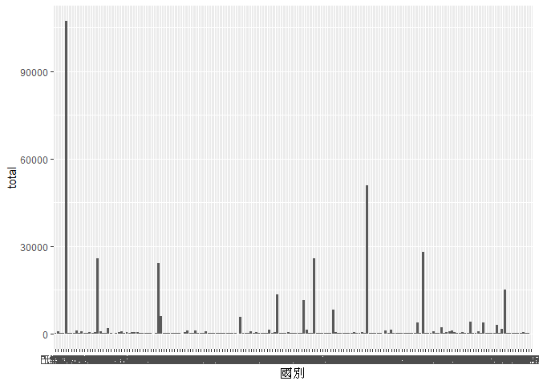
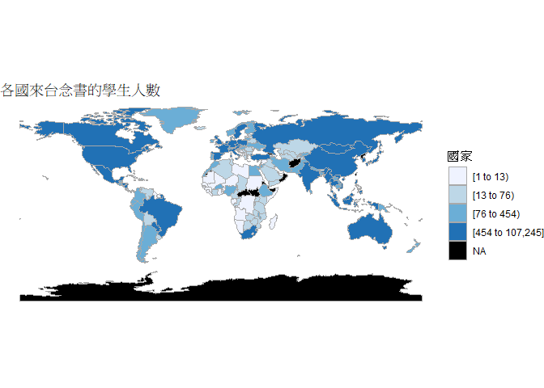
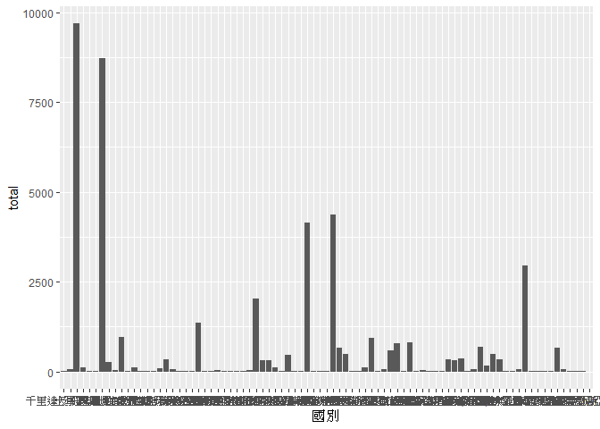
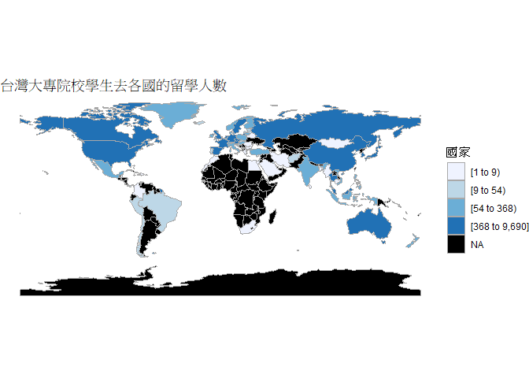
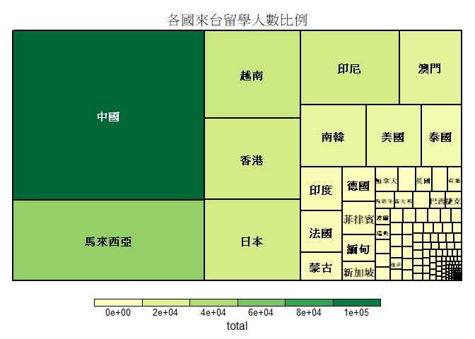
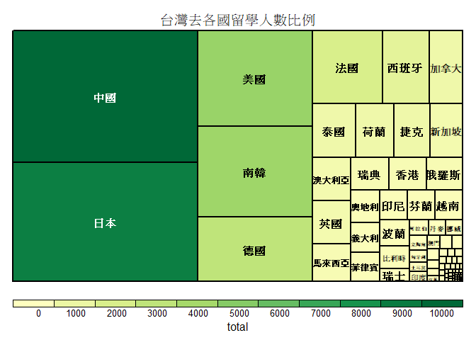

108-2 大數據分析方法 作業二
================
YenHsiu Liu

作業完整說明[連結](https://docs.google.com/document/d/1aLGSsGXhgOVgwzSg9JdaNz2qGPQJSoupDAQownkGf_I/edit?usp=sharing)

學習再也不限定在自己出生的國家，台灣每年有許多學生選擇就讀國外的大專院校，同時也有人多國外的學生來台灣就讀，透過分析大專校院境外學生人數統計、大專校院本國學生出國進修交流數、世界各主要國家之我國留學生人數統計表可以了解各大專院校國際交流的情形。請同學分析以下議題，並以視覺化的方式呈現分析結果，呈現105-107年以後大專院校國際交流的情形
(如提供網址資料有缺少年份，可嘗試自己google一下需要年份的資料)。

## 來台境外生分析

### 資料匯入與處理

``` r
library(readr)
library(tidyr)
library(dplyr)
```

    ## 
    ## Attaching package: 'dplyr'

    ## The following objects are masked from 'package:stats':
    ## 
    ##     filter, lag

    ## The following objects are masked from 'package:base':
    ## 
    ##     intersect, setdiff, setequal, union

``` r
library(ggplot2)
library(choroplethr)
```

    ## Loading required package: acs

    ## Loading required package: stringr

    ## Loading required package: XML

    ## 
    ## Attaching package: 'acs'

    ## The following object is masked from 'package:dplyr':
    ## 
    ##     combine

    ## The following object is masked from 'package:base':
    ## 
    ##     apply

``` r
library(readxl)
inter_student105 <- 
  read_csv("https://quality.data.gov.tw/dq_download_csv.php?nid=6289&md5_url=19bedf88cf46999da12513de755c33c6")
```

    ## Parsed with column specification:
    ## cols(
    ##   洲別 = col_character(),
    ##   國別 = col_character(),
    ##   學位生_正式修讀學位外國生 = col_double(),
    ##   `學位生_僑生(含港澳)` = col_double(),
    ##   學位生_正式修讀學位陸生 = col_double(),
    ##   非學位生_外國交換生 = col_double(),
    ##   非學位生_外國短期研習及個人選讀 = col_double(),
    ##   非學位生_大專附設華語文中心學生 = col_double(),
    ##   非學位生_大陸研修生 = col_double(),
    ##   非學位生_海青班 = col_double(),
    ##   境外專班 = col_double()
    ## )

``` r
inter_student106 <- 
  read_csv("https://quality.data.gov.tw/dq_download_csv.php?nid=6289&md5_url=57bc363ccce160a21b217889cf0a8413")
```

    ## Parsed with column specification:
    ## cols(
    ##   洲別 = col_character(),
    ##   國別 = col_character(),
    ##   學位生_正式修讀學位外國生 = col_number(),
    ##   `學位生_僑生(含港澳)` = col_number(),
    ##   學位生_正式修讀學位陸生 = col_number(),
    ##   非學位生_外國交換生 = col_double(),
    ##   非學位生_外國短期研習及個人選讀 = col_number(),
    ##   非學位生_大專附設華語文中心學生 = col_number(),
    ##   非學位生_大陸研修生 = col_number(),
    ##   非學位生_海青班 = col_number(),
    ##   境外專班 = col_double()
    ## )

``` r
inter_student107 <- 
  read_csv("https://quality.data.gov.tw/dq_download_csv.php?nid=6289&md5_url=3fcc20ce2557c2ba27468f8b73c8f312")
```

    ## Parsed with column specification:
    ## cols(
    ##   洲別 = col_character(),
    ##   國別 = col_character(),
    ##   學位生_正式修讀學位外國生 = col_double(),
    ##   `學位生_僑生(含港澳)` = col_double(),
    ##   學位生_正式修讀學位陸生 = col_double(),
    ##   非學位生_外國交換生 = col_double(),
    ##   非學位生_外國短期研習及個人選讀 = col_double(),
    ##   非學位生_大專附設華語文中心學生 = col_double(),
    ##   非學位生_大陸研修生 = col_double(),
    ##   非學位生_海青班 = col_double(),
    ##   境外專班 = col_double()
    ## )

``` r
inter_school105 <- 
  read_csv("https://quality.data.gov.tw/dq_download_csv.php?nid=6289&md5_url=1a485383cf9995da679c3798ab4fd681")
```

    ## Parsed with column specification:
    ## cols(
    ##   學校類型 = col_character(),
    ##   學校代碼 = col_character(),
    ##   學校名稱 = col_character(),
    ##   學位生_正式修讀學位外國生 = col_double(),
    ##   `學位生_僑生(含港澳)` = col_double(),
    ##   學位生_正式修讀學位陸生 = col_double(),
    ##   非學位生_外國交換生 = col_double(),
    ##   非學位生_外國短期研習及個人選讀 = col_double(),
    ##   非學位生_大專附設華語文中心學生 = col_double(),
    ##   非學位生_大陸研修生 = col_double(),
    ##   非學位生_海青班 = col_double(),
    ##   境外專班 = col_double()
    ## )

``` r
inter_school106 <-
  read_csv("https://quality.data.gov.tw/dq_download_csv.php?nid=6289&md5_url=a0dc5559421a6ad525fdc461bb87ff83")
```

    ## Parsed with column specification:
    ## cols(
    ##   學校類型 = col_character(),
    ##   學校代碼 = col_character(),
    ##   學校名稱 = col_character(),
    ##   學位生_正式修讀學位外國生 = col_double(),
    ##   `學位生_僑生(含港澳)` = col_double(),
    ##   學位生_正式修讀學位陸生 = col_double(),
    ##   非學位生_外國交換生 = col_double(),
    ##   非學位生_外國短期研習及個人選讀 = col_double(),
    ##   非學位生_大專附設華語文中心學生 = col_double(),
    ##   非學位生_大陸研修生 = col_double(),
    ##   非學位生_海青班 = col_double(),
    ##   境外專班 = col_double()
    ## )

``` r
inter_school107 <-
  read_csv("https://quality.data.gov.tw/dq_download_csv.php?nid=6289&md5_url=1f89cd92b57dc3e08b7337101fa70d52")
```

    ## Parsed with column specification:
    ## cols(
    ##   學校類型 = col_character(),
    ##   學校代碼 = col_character(),
    ##   學校名稱 = col_character(),
    ##   學位生_正式修讀學位外國生 = col_double(),
    ##   `學位生_僑生(含港澳)` = col_double(),
    ##   學位生_正式修讀學位陸生 = col_double(),
    ##   非學位生_外國交換生 = col_double(),
    ##   非學位生_外國短期研習及個人選讀 = col_double(),
    ##   非學位生_大專附設華語文中心學生 = col_double(),
    ##   非學位生_大陸研修生 = col_double(),
    ##   非學位生_海青班 = col_double(),
    ##   境外專班 = col_double()
    ## )

``` r
CountryName <- read_excel("C:/Users/user/Downloads/CountryName.xlsx")

inter_student105$國別<-gsub("中國大陸","大陸地區",inter_student105$國別)


#這是R Code Chunk
```

### 哪些國家來台灣唸書的學生最多呢？

``` r
inter_student105<-gather(inter_student105,stu,num,-洲別,-國別)
student105<-
  inter_student105%>%group_by(國別)%>%summarise(Total=sum(as.numeric(num)))
inter_student106<-gather(inter_student106,stu,num,-洲別,-國別)
student106<-
  inter_student106%>%group_by(國別)%>%summarise(Total=sum(as.numeric(num)))
inter_student107<-gather(inter_student107,stu,num,-洲別,-國別)
student107<-
  inter_student107%>%group_by(國別)%>%summarise(Total=sum(as.numeric(num)))


inter_student<-full_join(student105,student106,by="國別")
inter_student<-full_join(inter_student,student107,by="國別")
inter_student[is.na(inter_student)]<-0
inter_student$國別<-gsub("大陸地區","中國",inter_student$國別)

inter_student<-gather(inter_student,year,num,-國別)
inter_student<-inter_student%>%group_by(國別)%>%
  summarise(total=sum(as.numeric(num),na.rm = T))%>%arrange(desc(total))

knitr::kable(head(inter_student,10))
```

| 國別   |  total |
| :--- | -----: |
| 中國   | 107245 |
| 馬來西亞 |  50771 |
| 越南   |  27895 |
| 香港   |  25720 |
| 日本   |  25690 |
| 印尼   |  24243 |
| 澳門   |  15141 |
| 南韓   |  13441 |
| 美國   |  11385 |
| 泰國   |   8195 |

``` r
#這是R Code Chunk
```

### 哪間大學的境外生最多呢？

``` r
inter_school105<-gather(inter_school105,stu,num,-學校類型,-學校代碼,-學校名稱)
school105<-
  inter_school105%>%group_by(學校名稱)%>%summarise(total=sum(num))
inter_school106<-gather(inter_school106,stu,num,-學校類型,-學校代碼,-學校名稱)
school106<-
  inter_school106%>%group_by(學校名稱)%>%summarise(total=sum(num))
inter_school107<-gather(inter_school107,stu,num,-學校類型,-學校代碼,-學校名稱)
school107<-
  inter_school107%>%group_by(學校名稱)%>%summarise(total=sum(num))

inter_school<-full_join(school105,school106,by="學校名稱")
inter_school<-full_join(inter_school,school107,by="學校名稱")
inter_school[is.na(inter_school)]<-0

inter_school<-gather(inter_school,year,num,-學校名稱)
school<-inter_school%>%group_by(學校名稱)%>%
  summarise(total=sum(num))%>%arrange(desc(total))
school<-school[-1,]
knitr::kable(head(school,10))
```

| 學校名稱     | total |
| :------- | ----: |
| 國立臺灣師範大學 | 18501 |
| 國立臺灣大學   | 14502 |
| 銘傳大學     | 12120 |
| 淡江大學     | 11903 |
| 中國文化大學   | 11139 |
| 國立成功大學   |  9409 |
| 國立政治大學   |  9020 |
| 逢甲大學     |  8016 |
| 中原大學     |  8003 |
| 輔仁大學     |  7143 |

``` r
#這是R Code Chunk
```

### 各個國家來台灣唸書的學生人數長條圖

``` r
ggplot()+geom_bar(data = inter_student,aes(x=國別,y=total),stat = "identity")
```

<!-- -->

``` r
#這是R Code Chunk
```

### 各個國家來台灣唸書的學生人數面量圖

``` r
colnames(CountryName)<-c("arc","region","國別")
CountryName$region<-tolower(CountryName$region)
country<-inner_join(inter_student,CountryName,by="國別")
country<-country[!duplicated(country$region),]
country<-rename(country,value=total)

country_choropleth(country,title = "各國來台念書的學生人數",num_colors=4,legend="國家")
```

    ## Warning in super$initialize(country.map, user.df): Your data.frame contains the
    ## following regions which are not mappable: hong kong, macau, singapore, saint
    ## lucia, kiribati, palau, nauru, sao tome and principe, palaestina, mauritius,
    ## barbados, bahrain, monaco, liechtenstein, andorra, tonga, maldives

    ## Warning in self$bind(): The following regions were missing and are being set
    ## to NA: afghanistan, montenegro, oman, north korea, qatar, western sahara,
    ## south sudan, somaliland, east timor, taiwan, vanuatu, central african republic,
    ## northern cyprus, djibouti, eritrea, georgia, antarctica, equatorial guinea,
    ## kosovo

<!-- -->

``` r
#這是R Code Chunk
```

## 台灣學生國際交流分析

### 資料匯入與處理

``` r
exchange_student <- read_csv("C:/Users/user/Downloads/exchange student.csv", 
                             locale = locale(encoding = "BIG5"))
```

    ## Parsed with column specification:
    ## cols(
    ##   學年度 = col_double(),
    ##   學期 = col_double(),
    ##   設立別 = col_character(),
    ##   學校類別 = col_character(),
    ##   學校統計處代碼 = col_double(),
    ##   學校名稱 = col_character(),
    ##   系所代碼 = col_double(),
    ##   系所名稱 = col_character(),
    ##   `學制班別(日間)` = col_character(),
    ##   `進修交流國家(地區)別` = col_character(),
    ##   `進修交流國家(地區)區域別` = col_character(),
    ##   `本國學生出國進修交流至少1學期(修讀學分)以上人數小計` = col_double(),
    ##   `本國學生出國進修交流至少1學期(修讀學分)以上人數男` = col_double(),
    ##   `本國學生出國進修交流至少1學期(修讀學分)以上人數女` = col_double(),
    ##   `本國學生出國進修交流未滿1學期(修讀學分)人數小計` = col_double(),
    ##   `本國學生出國進修交流未滿1學期(修讀學分)人數男` = col_double(),
    ##   `本國學生出國進修交流未滿1學期(修讀學分)人數女` = col_double()
    ## )

    ## Warning: 20 parsing failures.
    ##   row      col               expected actual                                           file
    ##  1573 系所代碼 no trailing characters    A01 'C:/Users/user/Downloads/exchange student.csv'
    ##  3658 系所代碼 no trailing characters    C01 'C:/Users/user/Downloads/exchange student.csv'
    ##  4010 系所代碼 no trailing characters    C01 'C:/Users/user/Downloads/exchange student.csv'
    ##  9358 系所代碼 no trailing characters    C02 'C:/Users/user/Downloads/exchange student.csv'
    ## 11059 系所代碼 no trailing characters    C01 'C:/Users/user/Downloads/exchange student.csv'
    ## ..... ........ ...................... ...... ..............................................
    ## See problems(...) for more details.

``` r
exchange_student$`進修交流國家(地區)別`<-gsub("大陸地區","中國",exchange_student$`進修交流國家(地區)別`)
exchange_student$`進修交流國家(地區)別`<-gsub("朝鮮民主主義人民共和國(北韓)","北韓",exchange_student$`進修交流國家(地區)別`)
exchange_student$`進修交流國家(地區)別`<-gsub("印度尼西亞共和國","印尼",exchange_student$`進修交流國家(地區)別`)
exchange_student$`進修交流國家(地區)別`<-gsub("埃及阿拉伯共和國","埃及",exchange_student$`進修交流國家(地區)別`)
exchange_student$`進修交流國家(地區)別`<-gsub("蒙古國","蒙古",exchange_student$`進修交流國家(地區)別`)
exchange_student$`進修交流國家(地區)別`<-gsub("德意志聯邦共和國","德國",exchange_student$`進修交流國家(地區)別`)
exchange_student$`進修交流國家(地區)別`<-
  gsub("共和國|王國|侯國|聯邦|社會主義共和國|聯合大公國|合眾國|和平之國|民主社會主義共和國|伊斯蘭共和國|大公國|人民共和國","",exchange_student$`進修交流國家(地區)別`)

#這是R Code Chunk
```

### 台灣大專院校的學生最喜歡去哪些國家進修交流呢？

``` r
exchange_country<-exchange_student%>%
  select(`進修交流國家(地區)別`,`本國學生出國進修交流至少1學期(修讀學分)以上人數小計`,
         `本國學生出國進修交流未滿1學期(修讀學分)人數小計`)
exchange_country<-gather(exchange_country,stu,num,-`進修交流國家(地區)別`)
exchange_country<-exchange_country%>%group_by(`進修交流國家(地區)別`)%>%
  summarise(total=sum(num))%>%arrange(desc(total))
exchange_country<-rename(exchange_country,國別=`進修交流國家(地區)別`)

knitr::kable(head(exchange_country,10))
```

| 國別  | total |
| :-- | ----: |
| 中國  |  9690 |
| 日本  |  8731 |
| 美國  |  4366 |
| 南韓  |  4148 |
| 德國  |  2943 |
| 法國  |  2037 |
| 西班牙 |  1364 |
| 加拿大 |   951 |
| 泰國  |   924 |
| 荷蘭  |   819 |

``` r
#這是R Code Chunk
```

### 哪間大學的出國交流學生數最多呢？

``` r
exchange_school<-exchange_student%>%
  select(學校名稱,`本國學生出國進修交流至少1學期(修讀學分)以上人數小計`,
             `本國學生出國進修交流未滿1學期(修讀學分)人數小計`)
exchange_school<-gather(exchange_school,stu,num,-學校名稱)
exchange_school<-exchange_school%>%group_by(學校名稱)%>%
  summarise(total=sum(num))%>%arrange(desc(total))

knitr::kable(head(exchange_school,10))
```

| 學校名稱   | total |
| :----- | ----: |
| 國立臺灣大學 |  3657 |
| 淡江大學   |  3271 |
| 國立政治大學 |  2804 |
| 靜宜大學   |  1529 |
| 輔仁大學   |  1383 |
| 逢甲大學   |  1368 |
| 中國文化大學 |  1302 |
| 東吳大學   |  1262 |
| 國立交通大學 |  1150 |
| 東海大學   |  1054 |

``` r
#這是R Code Chunk
```

### 台灣大專院校的學生最喜歡去哪些國家進修交流條狀圖

``` r
ggplot()+geom_bar(data = exchange_country,aes(x=國別,y=total),stat = "identity")
```

    ## Warning: Removed 1 rows containing missing values (position_stack).

<!-- -->

``` r
#這是R Code Chunk
```

### 台灣大專院校的學生最喜歡去哪些國家進修交流面量圖

``` r
countrymap<-inner_join(exchange_country,CountryName,by="國別")
countrymap<-countrymap[!duplicated(countrymap$region),]
countrymap<-rename(countrymap,value=total)
country_choropleth(countrymap,title = "台灣大專院校學生去各國的留學人數",num_colors=4,legend="國家")
```

    ## Warning in super$initialize(country.map, user.df): Your data.frame contains the
    ## following regions which are not mappable: singapore, hong kong, macau, palau,
    ## mauritius, liechtenstein, andorra

    ## Warning in self$bind(): The following regions were missing and are being set
    ## to NA: angola, azerbaijan, moldova, madagascar, macedonia, mali, montenegro,
    ## mozambique, mauritania, burundi, malawi, namibia, niger, nigeria, nicaragua,
    ## nepal, oman, pakistan, papua new guinea, north korea, benin, paraguay, qatar,
    ## rwanda, western sahara, sudan, burkina faso, south sudan, senegal, solomon
    ## islands, sierra leone, el salvador, somaliland, somalia, republic of serbia,
    ## suriname, swaziland, syria, chad, togo, tajikistan, turkmenistan, east timor,
    ## tunisia, taiwan, united republic of tanzania, uganda, ukraine, uruguay,
    ## uzbekistan, the bahamas, venezuela, vanuatu, yemen, zambia, zimbabwe, bosnia
    ## and herzegovina, albania, bolivia, bhutan, botswana, central african republic,
    ## united arab emirates, ivory coast, cameroon, democratic republic of the congo,
    ## republic of congo, costa rica, cuba, northern cyprus, argentina, djibouti,
    ## algeria, ecuador, eritrea, armenia, ethiopia, fiji, gabon, georgia, ghana,
    ## antarctica, guinea, gambia, guinea bissau, equatorial guinea, guatemala, guyana,
    ## honduras, haiti, iraq, jamaica, jordan, kazakhstan, kenya, kyrgyzstan, kosovo,
    ## laos, lebanon, liberia, libya, lesotho

<!-- -->

``` r
#這是R Code Chunk
```

## 台灣學生出國留學分析

### 資料匯入與處理

``` r
exchange_student_total <- read_csv("C:/Users/user/Downloads/exchange_student_total.csv", 
    locale = locale(encoding = "BIG5"))
```

    ## Parsed with column specification:
    ## cols(
    ##   年度 = col_double(),
    ##   洲別 = col_character(),
    ##   國別 = col_character(),
    ##   總人數 = col_number()
    ## )

``` r
exchange_student_total<-rename(exchange_student_total,num=總人數)

#這是R Code Chunk
```

### 台灣學生最喜歡去哪些國家留學呢？

``` r
exchange_student_total<-exchange_student_total%>%group_by(國別)%>%
  summarise(value=sum(num))%>%arrange(desc(value))
knitr::kable(head(exchange_student_total,10))
```

| 國別   | value |
| :--- | ----: |
| 美國   | 63770 |
| 澳大利亞 | 30155 |
| 日本   | 28433 |
| 加拿大  | 13359 |
| 英國   | 11510 |
| 德國   |  5256 |
| 紐西蘭  |  2926 |
| 法國   |  2083 |
| 波蘭   |  2077 |
| 馬來西亞 |  1513 |

``` r
#這是R Code Chunk
```

### 台灣學生最喜歡去哪些國家留學面量圖

``` r
#total_student<-inner_join(exchange_student_total,CountryName,by="國別")
#total_student<-total_student[!duplicated(total_student$region),]
#county_choropleth(total_student,title = "台灣學生去各國的留學人數",num_colors=4,legend="國家")
#這是R Code Chunk
```

## 綜合分析

請問來台讀書與離台讀書的來源國與留學國趨勢是否相同(5分)？想來台灣唸書的境外生，他們的母國也有很多台籍生嗎？請圖文並茂說明你的觀察(10分)。

``` r
library(treemap)
treemap(inter_student,
        index = "國別",
        vSize="total",
        vColor="total",
        type="value",
        title="各國來台留學人數比例")
```

<!-- -->

``` r
treemap(exchange_country,
        index = "國別",
        vSize="total",
        vColor="total",
        type="value",
        title="台灣去各國留學人數比例")
```

<!-- -->

``` r
#從圖中可以看到來源國與留學國的趨勢並不相同，雖然最多的都是中國，不過其他來台留學的較多來自東南亞，而台灣學生的留學國則是東亞與歐洲國家為大宗。中國會是最多人數的其實也不意外，因為距離台灣近且語言相通，交流方便。而來源國多為東南亞我覺得是因為相較起來台灣的教育資源與環境較為發達，吸引東南亞國家的學生來台。留學國多為東亞與歐洲國家也是因為教育資源與環境的關係，而且如果直接在當地工作的薪水也比台灣來的高。
```
